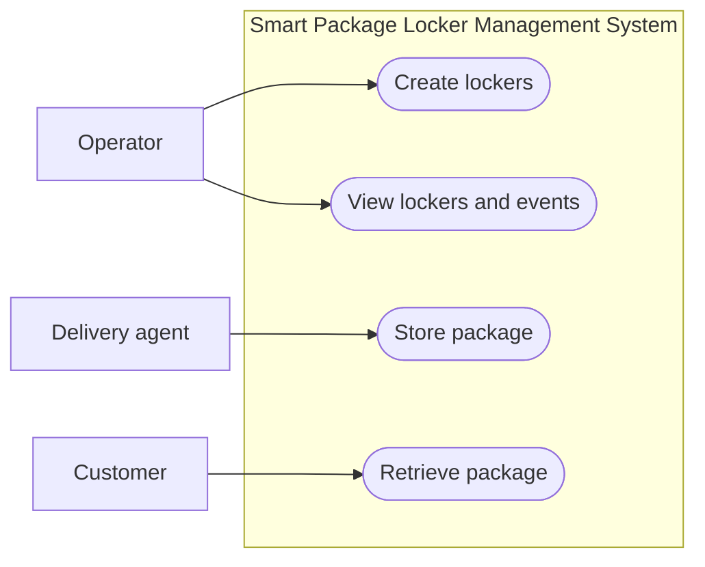

# Smart Package Locker Management System



## Tech Stack

| Layer                  | Technology                                           |
| ---------------------- | ---------------------------------------------------- |
| Backend                | TypeScript, ExpressJS, Sequelize                     |
| Database               | MySQL 8                                              |
| Frontend / Demo-client | TypeScript, React, MUI, React Router, TanStack Query |
| Deployment             | Docker                                               |

## Project structure

```text
src/
  composition/     Builds repositories, services, controllers, and routers
  routes/          HTTP endpoints
  schemas/         Request validation
  controllers/     HTTP request and response handling
  services/        Locker workflows and storage pricing
  repositories/    Database queries and transactions
  models/          Database Models
tests/             Unit, MySQL integration, and e2e tests
examples/
  demo-client/     React demo client
docs/             API reference, data model, and specifications
.github/
  workflows/      GitHub Actions test workflow
```

## Run with Docker

Prerequisite:

- Docker Compose
- Port 3000, 3001, 3002 are available

From the project root run:

```sh
docker compose up --build
```

Services will be available at the following endpoints:

| Services    | Endpoint                      | Description                                                             |
| ----------- | ----------------------------- | ----------------------------------------------------------------------- |
| api         | `http://localhost:3000/api/*` | REST API for locker and charge rules refer [API reference](docs/api.md) |
| demo-client | `http://localhost:3001`       | [Demo React client for trying the API with UI](#demo-client)            |
| MySQL       | `localhost:3002`              | MySQL Database                                                          |

## Tests

Prerequisite:

- Docker running (for MySQL integration tests)
- Node.js 22 or newer

```sh
npm ci
npm run typecheck
npm test
```

```text
tests/
  unit/          Service logic and storage pricing, with mocked repositories
  integration/   Repository and service behavior against MySQL: storage, retrieval, events, concurrency
  e2e/           HTTP workflows, validation, and error responses through the real app against MySQL
  helpers/       MySQL container setup and database fixtures
```

Run a group with `npm run test:unit`, `npm run test:integration`, or `npm run test:e2e`.
Each integration and e2e test file uses its own disposable MySQL container, cleared between tests. No database configuration is needed.

Run `npm run format` to format the project, or `npm run format:check` to check formatting. The root Prettier config also applies to the demo client.

## Demo Client

The [React demo client](examples/demo-client/) lets you test the API in a browser at `http://localhost:3001`.

### Locker management Page

Create lockers and inspect their current assignments.


### Locker console Page

Store or retrieve a package through the demo interface.


### Concurrency test Page

Send concurrent storage requests and inspect each result.


## Run development server

Prerequisite:

- Docker Compose
- Node.js 22 or newer

```sh
docker compose up mysql
npm ci
npm run dev
```

Set `DB_LOG_SQL=true` in `.env` to print SQL queries. Logging is off by default because queries contain pickup codes.

## Design decisions

Package details and pickup codes stay in the locker table because they only need to track the current assignment.

The `locker_events` table records when packages are stored or retrieved, so each locker's activity can be audited and review.

MySQL pessimistic row locks prevent two requests from taking the same locker or retrieving the same package. If another request takes the selected locker, storage looks for another available one.

Storage fee calculation is kept separate to make pricing easier to test and update.

## Documentation

- [API reference and request examples](docs/api.md)
- [Data model](docs/data-model.md)
- [Storage pricing](docs/storage-pricing.md)

## Out Of Scope, Limitation, improvement

- **Access control:** No authentication, role checks, or pickup-code rate limiting. The locker list exposes pickup codes for demonstration. These endpoints must be protected before a public deployment.
- **Production deployment:** The Docker setup is intended for local development. The `.env` file is committed and the MySQL port is exposed for convenience. Production use would require proper secret management and network restrictions.
- **Better production grade UI:** Currently `examples/demo-client` is a small React client for trying / testing the API, not a production quality frontend. The backend remains the source of truth for locker and charge rules.
- **API throttling & Locker Freezing:** User can brute force the pickup code, if user tried input for 10 time the locker should freeze and not allow reterive until admin unfreezed it.

## AI assistance

**Which AI tool(s) did you use?:** ChatGPT & Codex

**How did you use them?**

- ChatGPT
  - basic chat and discussion and learn the technical implemation as a replacement of searching for document for fast development
- Codex
  - AI assisted programming for code generation and debuging with context from `AGENTS.md` and `docs/`
  - Use custom /skill on repeated example `/code-review document`(docs and Readme) `/code-review requirement`(the pdf)
  - Challenge suggestions and generate alternate solution for review

**What portions of the solution were AI-assisted?**

Below is the top task AI-asseted through the development

- Research and discussion
- Code generation
- Code refactoring example renaming, change design, move function
- Perform Repetitive tasks eg Rename symbols across files, update imports and documentation links after moving files, format code, and update tests when API contracts change.
- Polish document

**Any prompts or workflow you’d like to share?**

My workflow for this project:

1. Set up the project structure and decide the responsibilities of routes, controllers, services, and repositories.
2. Document detailed API specifications, including validation and error responses, and prepare `AGENTS.md` with the project conventions.
3. Manually implement the Create Locker API and its tests as a reference for the remaining endpoints.
4. Ask the AI agent to implement the remaining APIs one at a time, including tests, following the specification and reference implementation. Review each change and ask for modified when not align with what i want, then have a review agent run `/code-review requirement` or `/code-review docs` and address its findings until the review passes. 
6. Run the full test suite and TypeScript checks, try the workflows through the demo client, and check that the documentation matches the implementation.
