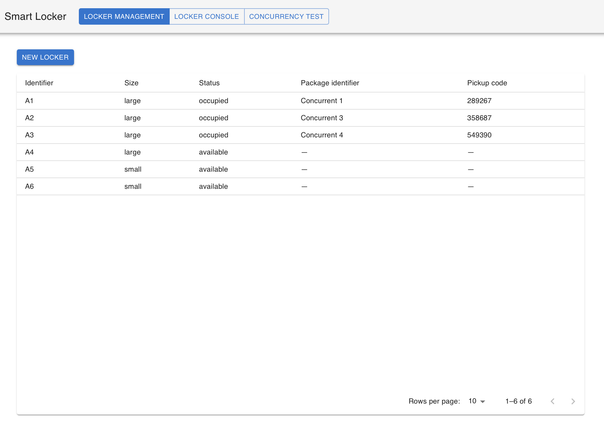
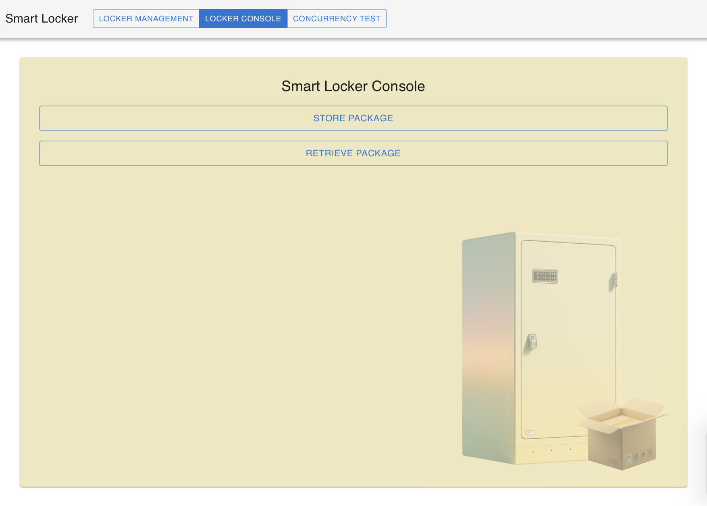
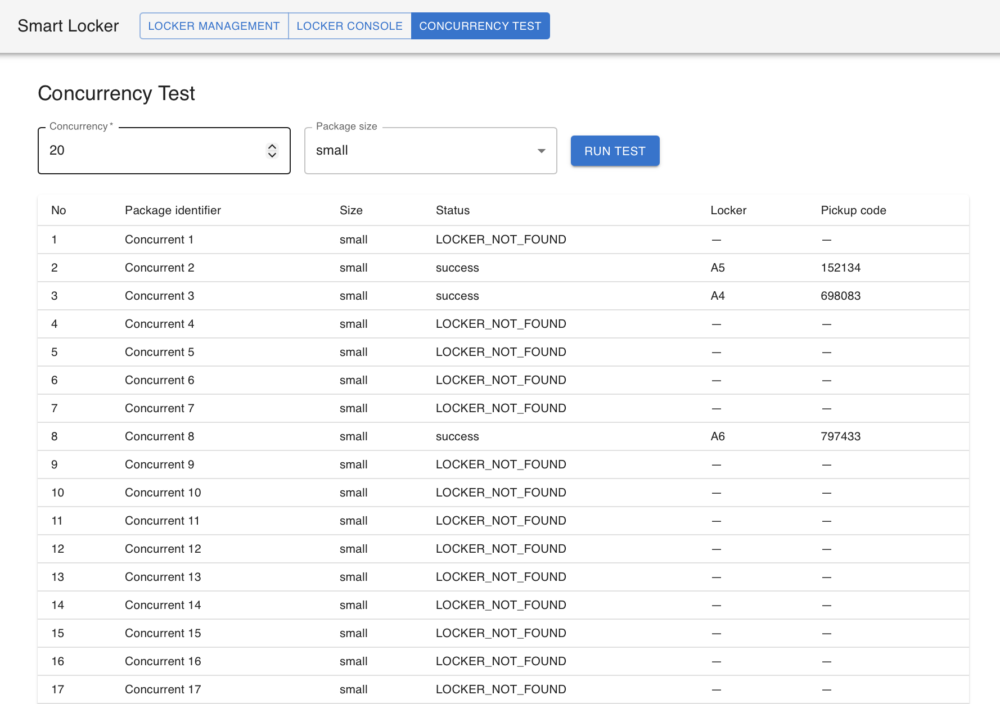

# Smart Package Locker Management System


## Tech Stack

| Layer                  | Technology                       |
| ---------------------- | -------------------------------- |
| Backend                | TypeScript, ExpressJS, Sequelize |
| Database               | MySQL 8                          |
| Frontend / Demo-client | TypeScript, React                |
| Deployment             | Docker                           |

## Project structure

```text
src/
  routes/          HTTP endpoints
  schemas/         Request validation
  controllers/     HTTP request and response handling
  services/        Locker workflows and storage pricing
  repositories/    Database queries and transactions
  models/          Database Models
tests/             API and integration tests
examples/
  demo-client/     React demo client
docs/             API reference, data model, and specifications
.github/
  workflows/      GitHub Actions test workflow
```

## Run with Docker

Prerequisite:

- Docker Compose
- Port 3000, 3001, 3002 are available

From the project root run:

```sh
docker compose up --build
```

Services will be available at the following endpoints:

| Services    | Endpoint                      | Description                                                             |
| ----------- | ----------------------------- | ----------------------------------------------------------------------- |
| api         | `http://localhost:3000/api/*` | REST API for locker and charge rules refer [API reference](docs/api.md) |
| demo-client | `http://localhost:3001`       | [Demo React client for trying the API with UI](#demo-client)            |
| MySQL       | `localhost:3002`              | MySQL Database                                                          |

## Tests

Prerequisite:

- Docker Compose
- Node.js 22 or newer

```sh
npm ci
npm run typecheck
npm test
```

The MySQL tests use a disposable `@testcontainers/mysql` database. They cover competing storage requests, simultaneous retrieval, rollback, and HTTP workflows. Service and pricing tests use deterministic inputs; the events API tests check routing and validation with a mocked service.

Review validation: `npm run typecheck`, `npm run build`, and all 61 default tests passed. The three opt-in MySQL tests also passed in a separate disposable database; the demo client passed its build and lint checks.

The separate `tests/locker-mysql.integration.test.ts` suite is opt-in. Set `RUN_MYSQL_INTEGRATION=1` and `TEST_DB_NAME` to a dedicated database beginning with `splms_test`, plus `TEST_DB_HOST`, `TEST_DB_PORT`, `TEST_DB_USER`, and `TEST_DB_PASSWORD`. It creates its tables and removes its own fixtures; never point it at the development database.

## Demo Client

The [React demo client](examples/demo-client/) lets you test the API in a browser at `http://localhost:3001`.

### Locker management

Create lockers and inspect their current assignments.



### Locker console

Store or retrieve a package through the demo interface.



### Concurrency test

Send concurrent storage requests and inspect each result.



## Run development server

Prerequisite:

- Docker Compose
- Node.js 22 or newer

```sh
docker compose up mysql
npm ci
npm run dev
```

## Design decisions

Controllers handle HTTP, services apply allocation and pricing rules, and the repository owns queries and transactions. The repository interface and injected clock/code generator make service tests deterministic. The public service type is derived from its methods so response shapes have one definition. The repository contract returns Sequelize models, so the application remains coupled to the ORM.

A locker row holds its current assignment. There is no separate package lifecycle to manage in this challenge. Successful storage and retrieval also write an event in the same transaction, so a failed event write rolls back the assignment change.

Allocation uses MySQL's enum order (`small`, `medium`, `large`) to select the smallest fit. The repository locks and rechecks that candidate before assigning it; if another request claimed it, the service searches again. Retrieval locks the matching assignment while the service calculates charges and decides whether to release it. The callback keeps pricing out of the repository without moving the calculation outside the lock.

The pricing policy charges completed 24-hour periods in integer cents. Keeping it separate makes the tier boundaries easy to test and allows pricing to change without editing retrieval. Previewed charges are recalculated on confirmation; this is charge acceptance, not a payment integration.

## Documentation

- [API reference and request examples](docs/api.md)
- [Data model](docs/data-model.md)
- [Storage pricing](docs/specs/storage-pricing.md)

## Out Of Scope or Not Implemented

- **Access control:** No authentication, role checks, or pickup-code rate limiting. The locker list exposes pickup codes for demonstration. These endpoints must be protected before a public deployment.
- **Production deployment:** The tracked `.env` and published service ports support local demonstration, not production secret management or network security. The services may be reachable from other devices on the host network.
- **Demo UI:** `examples/demo-client` is a small React client for trying the API, not a production quality frontend. The backend remains the source of truth for locker and charge rules.
- **Schema changes:** Startup uses `sequelize.sync()` for initial table creation. Versioned migrations are needed to evolve an existing database.
- **Pickup-code lifetime:** The database guarantees uniqueness among active assignments. Codes may be reused after retrieval; expiry and permanent code history are not implemented.
- **External systems:** Physical locker opening, notifications, and payment processing are outside the implementation.

## AI assistance

OpenAI Codex was used for a pre-submission code review and follow-up changes to service typing and clock use, test coverage and cleanup, documentation, and demo-client cleanup. The review used the challenge and recruiter notes, inspected the implementation, and ran the project checks. The submission author remains responsible for understanding and verifying the result.
