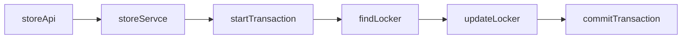

# Standardization

This API plan is a draft. Response examples are illustrative and not finalized.

## Error Structure

```
{
  "code": "LOCKER_NOT_FOUND",
  "message": "No suitable locker found."
}
```

### Error Codes

| Error Code               | HTTP status | description                                                      |
| ------------------------ | ----------- | ---------------------------------------------------------------- |
| LOCKER_NOT_FOUND         | 404         | No suitable locker found                                         |
| LOCKER_IDENTIFIER_EXISTS | 409         | Identifier conflict when create locker                           |
| PACKAGE_NOT_FOUND        | 404         | No current package matches the locker identifier and pickup code |
| VALIDATION_ERROR         | 400         | Request fields are missing, malformed, or unsupported            |

# Challenge API

## Level 1

`[POST] /lockers`

Create a locker entry in the database. New lockers have status `available`; `status` is not an accepted request body field.

Request Body

| attribute  | required | description                                        |
| ---------- | -------- | -------------------------------------------------- |
| identifier | true     | Unique physical label for the locker, such as `A1` |
| size       | true     | Size of the locker `"small", "medium", "large"`    |

Response (draft)
HTTP 201

```
{
    "id": 1,
    "identifier": "A1",
    "size": "small",
    "status": "available"
}
```

Error

HTTP 409

```
{
    "code": "LOCKER_IDENTIFIER_EXISTS",
    "message": "A locker with the same identifier already exists."
}
```

`[GET] /lockers`

List lockers with their current availability. Default sort is by `identifier` in ascending order. Pickup codes are not included in the list response.

Query Parameters

| attribute | required | description                                      |
| --------- | -------- | ------------------------------------------------ |
| page      | false    | Page of result default `1`                       |
| limit     | false    | Limit of result default `10`                     |
| search    | false    | Wildcard search of locker `identifier`           |
| status    | false    | Filter by `available`, `inactive`, or `occupied` |

Response (draft example with `limit=20`)
HTTP 200

```
{
    "data": [
        {
            "id": 1,
            "identifier": "A1",
            "size": "small",
            "status": "available"
        }
    ],
    "pagination": {
        "page": 1,
        "limit": 20,
        "total": 120,
        "totalPages": 6
    }
}
```

`[POST] /lockers/store`

Store a package in a suitable available locker. A successful request represents completed storage, with hardware interaction mocked. The locker becomes `occupied`, and its current package identifier and pickup code are saved.

Record the server's storage time for this assignment in `lastOccupiedAt`. This is the start of the charge calculation, not the locker's creation time or last update time. Each new assignment gets a new timestamp; clients do not supply it.

Request Body

| attribute         | required | description                                                                                  |
| ----------------- | -------- | -------------------------------------------------------------------------------------------- |
| size              | true     | Size of the package `"small", "medium", "large"`                                             |
| packageIdentifier | true     | Non-unique package name, label, or order reference; multiple packages may use the same value |

Response
Error

HTTP 404

```
{
  "code": "LOCKER_NOT_FOUND",
  "message": "No suitable locker found."
}
```

Success (draft)

HTTP 200

```
{
  "lockerId": 1,
  "identifier": "A1",
  "packageIdentifier": "ORDER-123",
  "pickupCode": "048291",
  "status": "occupied"
}
```

## Level 2 & 3

`[POST] /lockers/retrieve`

Look up the current package using its locker identifier and pickup code, calculate its storage charges, and either preview the charges or complete retrieval. Only a response with `status: "retrieved"` represents completed retrieval, with hardware interaction mocked, and makes the locker available for another delivery.

Request Body

| attribute        | required | description                                                                                                                                                                                                       |
| ---------------- | -------- | ----------------------------------------------------------------------------------------------------------------------------------------------------------------------------------------------------------------- |
| lockerIdentifier | true     | Non-empty string, trimmed, at most 128 characters. Physical locker label, such as `"A1"`, matching `identifier` returned by the storage endpoint.                                                                 |
| pickupCode       | true     | String containing exactly six digits. Pickup code returned when the package was stored; preserve leading zeros, such as `"048291"`.                                                                               |
| confirmCharges   | false    | Boolean. If charges are zero, retrieve immediately regardless of this field. If charges are positive, `true` confirms the calculated charge and completes retrieval; `false` or omitted returns a charge preview. |

### Preview and confirmation

Valid requests for packages stored for less than 24 hours retrieve immediately with zero charges. At exactly 24 hours, the first completed day costs 100 cents and charge confirmation is required.

| Calculated charge           | Request                                      | Response status    | Effect on the locker                                                                             |
| --------------------------- | -------------------------------------------- | ------------------ | ------------------------------------------------------------------------------------------------ |
| Zero (less than 24 hours)   | `confirmCharges` omitted, `false`, or `true` | `retrieved`        | Retrieves immediately, clears the current assignment, and makes the locker available.            |
| Positive (24 hours or more) | `confirmCharges` omitted or `false`          | `charges_required` | Remains occupied; package, pickup code, and storage timestamp stay unchanged.                    |
| Positive (24 hours or more) | `confirmCharges: true`                       | `retrieved`        | Completes mocked opening/removal, clears the current assignment, and makes the locker available. |

`charges_required` means a positive charge requires confirmation; it does not indicate a payment failure. HTTP 200 alone does not mean the package was retrieved. `confirmCharges: false` is not a guaranteed preview-only operation: a valid zero-charge request completes retrieval.

Confirmation revalidates the current assignment and recalculates charges using the confirmation request's server time. A preview does not freeze the amount: crossing a completed-day boundary can increase the final charge. `confirmCharges: true` accepts that recalculated amount, and a prior preview is not required. This is charge acknowledgement only; payment processing is outside this draft.

On completed retrieval, capture the package identifier, storage timestamp, and calculated charge for the response before clearing `packageIdentifier`, `pickupCode`, and `lastOccupiedAt`. The old code then cannot retrieve that completed assignment again.

Response
Error

HTTP 400

Return `VALIDATION_ERROR` for missing required fields, invalid field types or formats, or unknown fields. `confirmCharges`, when supplied, must be a JSON boolean; strings such as `"true"` are invalid. Clients cannot supply the storage timestamp, duration, or charge amount. Validation failures do not change the assignment.

HTTP 404

Return `PACKAGE_NOT_FOUND` when the locker identifier is unknown, the pickup code does not match that locker's current assignment (including a code belonging to another locker), or the locker has no current occupied assignment (including a repeated request after successful retrieval). Apply the same checks to preview and confirmation requests. Failed retrieval requests leave the locker and its current assignment unchanged.

```
{
  "code": "PACKAGE_NOT_FOUND",
  "message": "No package found for the provided locker identifier and pickup code."
}
```

Completed retrieval (draft)

Immediate retrieval before 24 hours, without charge confirmation:

HTTP 200

```json
{
  "status": "retrieved",
  "packageIdentifier": "ORDER-123",
  "occupiedAt": "2024-06-01T12:00:00Z",
  "calculatedAt": "2024-06-02T11:00:00Z",
  "chargesInCents": 0
}
```

Retrieval at exactly 24 hours with `confirmCharges: true`:

HTTP 200

```
{
  "status": "retrieved",
  "packageIdentifier": "ORDER-123",
  "occupiedAt": "2024-06-01T12:00:00Z",
  "calculatedAt": "2024-06-02T12:00:00Z",
  "chargesInCents": 100
}
```

Charge preview (draft)

HTTP 200

```
{
  "status": "charges_required",
  "packageIdentifier": "ORDER-123",
  "occupiedAt": "2024-06-01T12:00:00Z",
  "calculatedAt": "2024-06-02T12:00:00Z",
  "chargesInCents": 100
}
```

### Charge calculation

A day is 24 elapsed hours from storage. The base daily rate is 100 cents (one monetary unit). Amounts are integer cents in a single application currency.

Bill completed days only: truncate fractional days, with no minimum fee or separate grace period. Less than 24 hours costs zero; each completed 24-hour period is billed at its applicable tier.

| Completed storage day | Charge per day |
| --------------------- | -------------- |
| 1–5                   | 100 cents      |
| 6–10                  | 200 cents      |
| 11 onward             | 300 cents      |

Calculate on the backend using the current assignment's saved `lastOccupiedAt` and one server timestamp (`calculatedAt`) per request. Return both timestamps as UTC ISO 8601 strings; `occupiedAt` is the API name for `lastOccupiedAt`. Do not use calendar-date differences or client time.

```text
millisecondsPerDay = 24 * 60 * 60 * 1000
storageTime = calculatedAt - lastOccupiedAt
totalDays = floor(storageTime / millisecondsPerDay)
tier1 = min(totalDays, 5) * 100
tier2 = min(max(totalDays - 5, 0), 5) * 200
tier3 = max(totalDays - 10, 0) * 300
chargesInCents = tier1 + tier2 + tier3
```

The calculation assumes a valid stored timestamp no later than `calculatedAt`. Missing or invalid storage times are data errors, not zero-charge assignments; do not complete retrieval using a guessed timestamp.

Charge examples:

| Elapsed storage time | Completed days | Total charge in cents |
| -------------------- | -------------- | --------------------- |
| Less than 24 hours   | 0              | 0                     |
| Exactly 24 hours     | 1              | 100                   |
| Exactly 120 hours    | 5              | 500                   |
| 143 hours            | 5              | 500                   |
| Exactly 144 hours    | 6              | 700                   |
| Exactly 240 hours    | 10             | 1,500                 |
| Exactly 264 hours    | 11             | 1,800                 |

## Level 4

> Pessimisctic Locking


