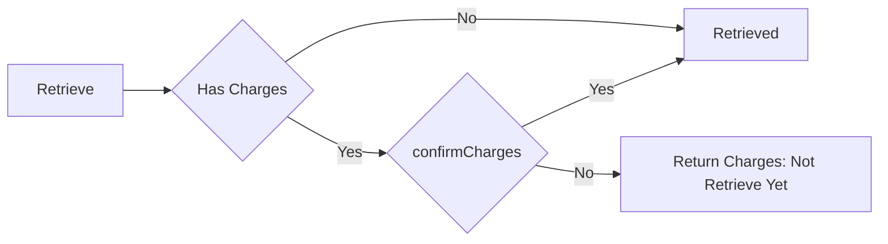

# API reference

| Method | Path                                                   | Purpose                                                    |
| ------ | ------------------------------------------------------ | ---------------------------------------------------------- |
| `POST` | [`/api/lockers`](#create-a-locker)                     | Create a locker                                            |
| `GET`  | [`/api/lockers`](#list-lockers)                        | List lockers                                               |
| `GET`  | [`/api/lockers/:lockerId/events`](#list-locker-events) | List recorded events for a locker                          |
| `POST` | [`/api/lockers/store`](#store-a-package)               | Assign a package to the smallest suitable available locker |
| `POST` | [`/api/lockers/retrieve`](#retrieve-a-package)         | Preview charges or retrieve a package                      |

## Create a locker

`POST /api/lockers`

```json
{
  "identifier": "A1",
  "size": "small"
}
```

| Fields       | Rule                                                   |
| ------------ | ------------------------------------------------------ |
| `identifier` | Unique physical label such as `A1`, used for retrieval |
| `size`       | Must be `small`, `medium`, or `large`.                 |

`201 Created`

```json
{
  "id": 1,
  "identifier": "A1",
  "size": "small",
  "status": "available"
}
```

### Possible errors

| HTTP status | Code                       | When the error occurs                                        |
| ----------- | -------------------------- | ------------------------------------------------------------ |
| 400         | `VALIDATION_ERROR`         | Missing, invalid, or unknown request fields; malformed JSON. |
| 409         | `LOCKER_IDENTIFIER_EXISTS` | A locker already has this identifier.                        |
| 500         | `INTERNAL_SERVER_ERROR`    | An unexpected server error occurs.                           |

## List lockers

`GET /api/lockers`

| Query parameter | Default | Description                                                                  |
| --------------- | ------- | ---------------------------------------------------------------------------- |
| `page`          | `1`     | Positive integer page number.                                                |
| `limit`         | `10`    | Positive integer from 1 to 100.                                              |
| `search`        | None    | Identifier search, at most 128 characters; `%` and `_` act as SQL wildcards. |
| `status`        | None    | `available` or `occupied`                                                    |

`200 OK` for `GET /api/lockers?status=occupied&page=1&limit=10`

```json
{
  "data": [
    {
      "id": 1,
      "identifier": "A1",
      "size": "small",
      "status": "occupied",
      "packageIdentifier": "ORDER-123",
      "pickupCode": "048291"
    }
  ],
  "pagination": {
    "page": 1,
    "limit": 10,
    "total": 1,
    "totalPages": 1
  }
}
```

> For this demo, pickup codes are included in the list to simplify debugging and testing. Codes are unique among current assignments and may be reused after retrieval.

### Possible errors

| HTTP status | Code                    | When the error occurs                    |
| ----------- | ----------------------- | ---------------------------------------- |
| 400         | `VALIDATION_ERROR`      | A query parameter is invalid or unknown. |
| 500         | `INTERNAL_SERVER_ERROR` | An unexpected server error occurs.       |

## List locker events

`GET /api/lockers/:lockerId/events`

| path parameter | Description |
| -------------- | ----------- |
| `lockerId`     | locker's id |

| Query parameter | Default | Description                     |
| --------------- | ------- | ------------------------------- |
| `page`          | `1`     | Positive integer page number.   |
| `limit`         | `10`    | Positive integer from 1 to 100. |

`200 OK` for `GET /api/lockers/1/events`

```json
{
  "data": [
    {
      "id": 1,
      "eventType": "package_stored",
      "lockerStatus": "occupied",
      "packageIdentifier": "ORDER-123",
      "chargesInCents": null,
      "createdAt": "2026-06-01T12:00:00.000Z"
    }
  ],
  "pagination": {
    "page": 1,
    "limit": 10,
    "total": 1,
    "totalPages": 1
  }
}
```

### Possible errors

| HTTP status | Code                    | When the error occurs                          |
| ----------- | ----------------------- | ---------------------------------------------- |
| 400         | `VALIDATION_ERROR`      | The locker ID or a query parameter is invalid. |
| 404         | `LOCKER_NOT_FOUND`      | The locker does not exist.                     |
| 500         | `INTERNAL_SERVER_ERROR` | An unexpected server error occurs.             |

## Store a package

`POST /api/lockers/store`

```json
{
  "size": "small",
  "packageIdentifier": "ORDER-123"
}
```

| Field               | Required | Description                                                                        |
| ------------------- | -------- | ---------------------------------------------------------------------------------- |
| `size`              | true     | Size of the package. small, medium, or large.                                      |
| `packageIdentifier` | true     | Package identifier example, order id, sku, name, or any text that identify package |

`200 OK`

```json
{
  "lockerId": 1,
  "identifier": "A1",
  "packageIdentifier": "ORDER-123",
  "pickupCode": "048291",
  "status": "occupied"
}
```

### Possible errors

| HTTP status | Code                            | When the error occurs                                        |
| ----------- | ------------------------------- | ------------------------------------------------------------ |
| 400         | `VALIDATION_ERROR`              | Missing, invalid, or unknown request fields; malformed JSON. |
| 404         | `NO_AVAILABLE_LOCKER`           | No suitable available locker exists.                         |
| 500         | `PICKUP_CODE_GENERATION_FAILED` | A unique pickup code cannot be generated after retries.      |
| 500         | `INTERNAL_SERVER_ERROR`         | An unexpected server error occurs.                           |

## Retrieve a package

`POST /api/lockers/retrieve`

```json
{
  "lockerIdentifier": "A1",
  "pickupCode": "048291"
}
```

| Body field         | Required | Description                                                                                         |
| ------------------ | -------- | --------------------------------------------------------------------------------------------------- |
| `lockerIdentifier` | Yes      | Locker's user facing `identifier` (such as `A1`), 1–128 characters after trimming, not `id`.        |
| `pickupCode`       | Yes      | Exactly six digits as a **string**, including any leading zeros.                                    |
| `confirmCharges`   | No       | Omitted or `false` previews a positive charge; `true` accepts the charge and retrieves the package. |

For a matching occupied locker, both outcomes return `200 OK` with the same fields:



Positive-charge preview (`confirmCharges` omitted):

```json
{
  "status": "charges_required",
  "packageIdentifier": "ORDER-123",
  "occupiedAt": "2024-06-01T12:00:00.000Z",
  "calculatedAt": "2024-06-02T12:00:00.000Z",
  "chargesInCents": 100
}
```

Retrieved

```json
{
  "status": "retrieved",
  "packageIdentifier": "ORDER-123",
  "occupiedAt": "2024-06-01T12:00:00.000Z",
  "calculatedAt": "2024-06-02T12:00:00.000Z",
  "chargesInCents": 100
}
```

### Possible errors

| HTTP status | Code                    | When the error occurs                                                 |
| ----------- | ----------------------- | --------------------------------------------------------------------- |
| 400         | `VALIDATION_ERROR`      | Missing, invalid, or unknown request fields; malformed JSON.          |
| 404         | `PACKAGE_NOT_FOUND`     | No occupied assignment matches the locker identifier and pickup code. |
| 500         | `INTERNAL_SERVER_ERROR` | An unexpected server or stored-data error occurs.                     |

## Error responses

Request bodies reject unknown fields. Errors include a `code` and `message`. Validation errors also include a `details` array of field-level messages.

A request to an unknown route returns `404` with the plain-text body `Not Found`.

```json
{
  "code": "VALIDATION_ERROR",
  "message": "Request validation failed.",
  "details": [
    {
      "field": "pickupCode",
      "message": "Pickup code must contain exactly 6 digits."
    }
  ]
}
```
